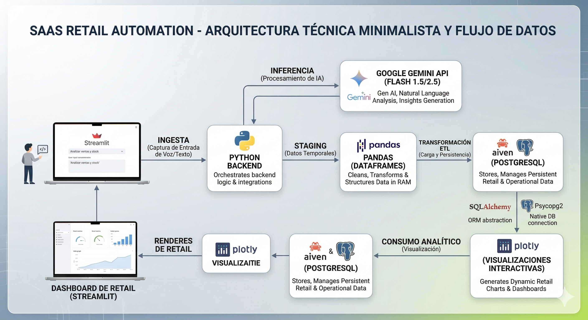
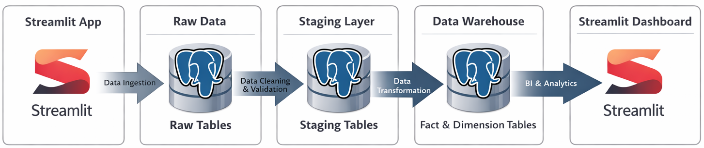
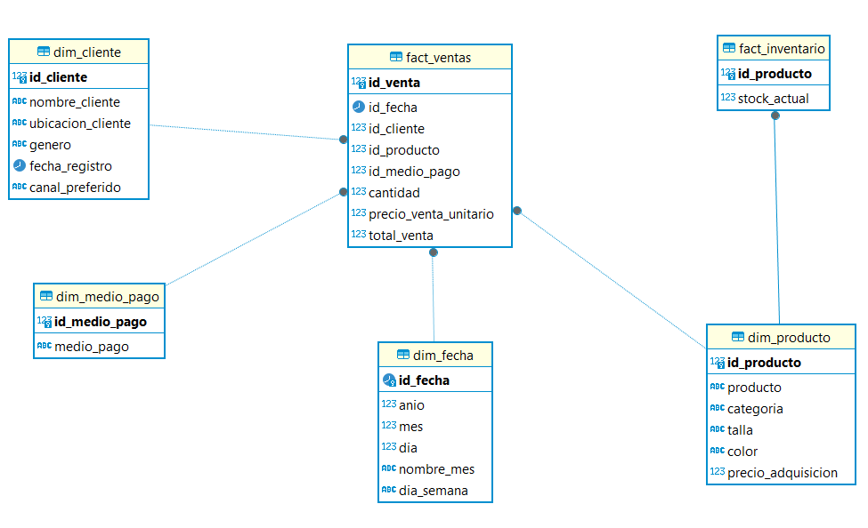

# DATAMARK - Plataforma Analítica y Transaccional Automatizada

## 🏆 Insignias


## 📌 Índice
- [Descripción](#-descripción)
- [Documentación Técnica (Modular)](#-documentación-técnica-modular)
- [Roles del Proyecto](#-roles-del-proyecto)
- [Funciones y Aplicaciones](#-funciones-y-aplicaciones)
- [Arquitectura de la Solución](#️-arquitectura-de-la-solución)
- [Estructura del Proyecto](#-estructura-del-proyecto)
- [Tecnologías Utilizadas](#-tecnologías-utilizadas)
- [Base de Datos (Aiven PostgreSQL)](#️-base-de-datos-aiven-postgresql)
- [Despliegue (Streamlit Cloud)](#️-despliegue-streamlit-cloud)
- [Instalación y Contribución](#-instalación-y-contribución)
- [Autores](#-autores)

---

## 📙 Descripción
**DATAMARK** es una plataforma integral diseñada para pequeños y medianos negocios (retail, calzado, ropa) en provincias del Perú. Actúa como un *Data Analyst Automatizado*, combinando la facilidad de **Streamlit** para la ingesta de datos con NLP (Lenguaje Natural) y la solidez de **PostgreSQL** alojado en la nube de **Aiven**. Transforma la captura de ventas diarias y la gestión de inventario en reportes y dashboards dinámicos para la toma de decisiones.

> 🌐 **Prueba la Aplicación en Vivo**: [DATAMARK (Streamlit Community Cloud)](https://datamark-analytics.streamlit.app/Ingesta_Ventas)

---

## 📚 Documentación Técnica (Modular)
Para una comprensión profunda de los componentes del sistema, consulta nuestra documentación especializada:

- [**📔 Índice Maestro de Documentación**](./documentacion/README.md)
- [🏗️ Arquitectura y Flujo Detallado](./documentacion/arquitectura.md)
- [🗄️ Modelo de Base de Datos y Diccionario](./documentacion/base_de_datos.md)
- [🤖 Inteligencia Artificial y Lógica NLP](./documentacion/ia_nlp.md)
- [🚀 Guía de Funcionalidades y Dashboards](./documentacion/funcionalidades.md)
- [🛠️ Guía de DevOps, Setup y Troubleshooting](./documentacion/guia_desarrollo.md)

---

##  Screenshots de la Plataforma

| Landing Page | Ingesta de Datos (NLP & Excel) |
|:---:|:---:|
|  |  |
| **Control de Base de Datos (CRUD)** | **Dashboard Analítico** |
|  |  |

---

## 👥 Roles del Proyecto
El desarrollo se dividió en roles especializados para asegurar calidad y modularidad:
- **Implementador (Core & Backend)**: Creación de la arquitectura base, flujos transaccionales (CRUD), validaciones lógicas y conexiones seguras con la base de datos (`libs.db_connection`, Psycopg2 y SQL puro sin abstracciones innecesarias).
- **Especialista AI (NLP)**: Integración de los modelos Gemini Flash para permitir la inyección de datos a través de inteligencia artificial (dictados de voz y deducción de atributos faltantes).
- **Frontend / Data Viz**: Diseño de la SPA en el Framework de Streamlit, incluyendo el Landing Page y las gráficas analíticas interactivas.

---

## 🎥 Funciones y Aplicaciones
- **Ingesta Inteligente**: Registro de ventas mediante voz (dictado natural), carga masiva (Excel/CSV) o ingreso manual, con NLP y expresiones regulares deterministas.
- **Gestión CRUD Integrada**: Edición visual directa (`st.data_editor`) sobre las tablas transaccionales de la base de datos de manera paginada.
- **Dashboarding Dinámico**: Tableros analíticos creados en tiempo real leyendo directamente del Data Warehouse.
- **Validación Estricta**: Sistema anti-caídas que revisa relaciones físicas (Stock suficiente, Cliente existente) antes de impactar en la capa transaccional.

---

## 🏗️ Arquitectura de la Solución

El flujo de información desde la interacción del usuario hasta el almacenamiento analítico en la nube sigue un modelo robusto de tres capas:

### Arquitectura de Tecnologías


### Flujo de Datos (Pipeline)


---

## 📁 Estructura del Proyecto

El repositorio está diseñado bajo el principio de **Separación de Responsabilidades (SoC)**, asegurando que el código visual (Streamlit) no se mezcle con la lógica dura de base de datos o Inteligencia Artificial.

```text
proyecto-de-proyectos/
├── documentacion/                    # 📔 Documentación Técnica Detallada
├── imagen/                           # Carpeta auto-gestionada para screenshots y recursos de UI
├── libs/                             # 🧱 Core Técnico (Compartido)
├── modules/                          # 🧠 Cerebro del Proyecto (Micro-Arquitecturas)
├── pages/                            # 🌐 Front-Door (Ruteo de Streamlit)
├── scripts/                          # 🛠️ Herramientas de Línea de Comandos (DevOps)
├── .env.example                      # Plantilla de secretos requeridos
├── requirements.txt                  # Strict list de dependencias Python
├── main.py                           # Entrypoint de Streamlit corriendo el Landing Page
└── README.md                         # Este manifiesto global
```

---

## 💻 Tecnologías Utilizadas
- **Core de Programación**: Python 3.10+
- **Framework Frontend**: [Streamlit](https://streamlit.io/)
- **Procesamiento de Datos**: Pandas, NumPy, TheFuzz
- **Inteligencia Artificial**: Google Gemini API (2.5 Flash)
- **Control de Bases de Datos**: `psycopg2` puro

---

## 🗄️ Base de Datos (Aiven PostgreSQL)
**DATAMARK** se enorgullece de usar **[Aiven for PostgreSQL](https://aiven.io/)** como su base de datos principal, garantizando alta disponibilidad, seguridad y resiliencia en la nube. 
El diseño utiliza arquitectura por esquemas (`raw`, `staging`, `warehouse`), priorizando la estabilidad del OLTP.

### Modelo Dimensional (Data Warehouse)
El esquema `warehouse` implementa un modelo tipo **Star Schema**, optimizado para análisis OLAP.



---

## ☁️ Despliegue (Streamlit Cloud)
El proyecto ha sido concebido para ser hosteado bajo *Streamlit Community Cloud*. Toda la configuración ambiental dependiente (Aiven DB Hosts, Passwords, Gemini API Key) está estructurada para cargarse de forma segura a través de los *Streamlit Secrets*.

---

## 🚀 Instalación y Contribución

### 1. Requisitos Previos
- Python 3.10 o superior.
- Git.

### 2. Clonar y Preparar el Entorno
```bash
git clone https://github.com/No-Country-simulation/-S02-26-Equipo-53-Data-Science.git
cd -S02-26-Equipo-53-Data-Science
python -m venv env
source env/bin/activate  # o env\Scripts\activate en Windows
pip install -r requirements.txt
```

### 3. Configuración del Módulo
Copia el archivo base de variables y llena tus credenciales (Aiven PostgreSQL / Gemini):
```bash
cp .env.example .env
```

### 4. Ejecución del Proyecto
Inicia el servidor local de Streamlit:
```bash
streamlit run main.py
```

---

## 👥 Autores
- **Dabalos Carla**
- **Estrada Leomar**
- **Paye Cahui Oscar Fernando**
- **Tantarico Minchola Galia Lizbeth**

---
© 2026 DATAMARK Team | No Country Simulation
