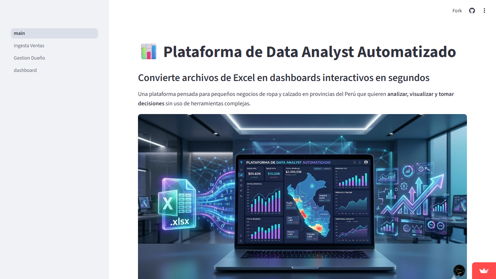
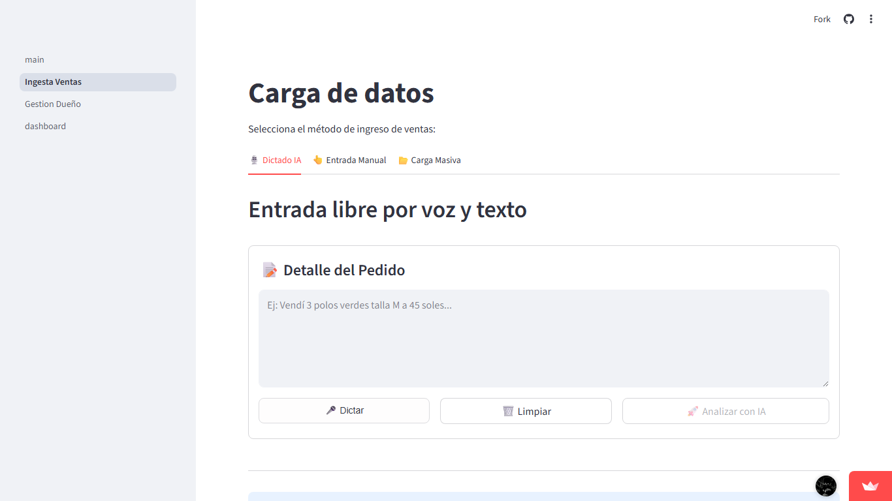
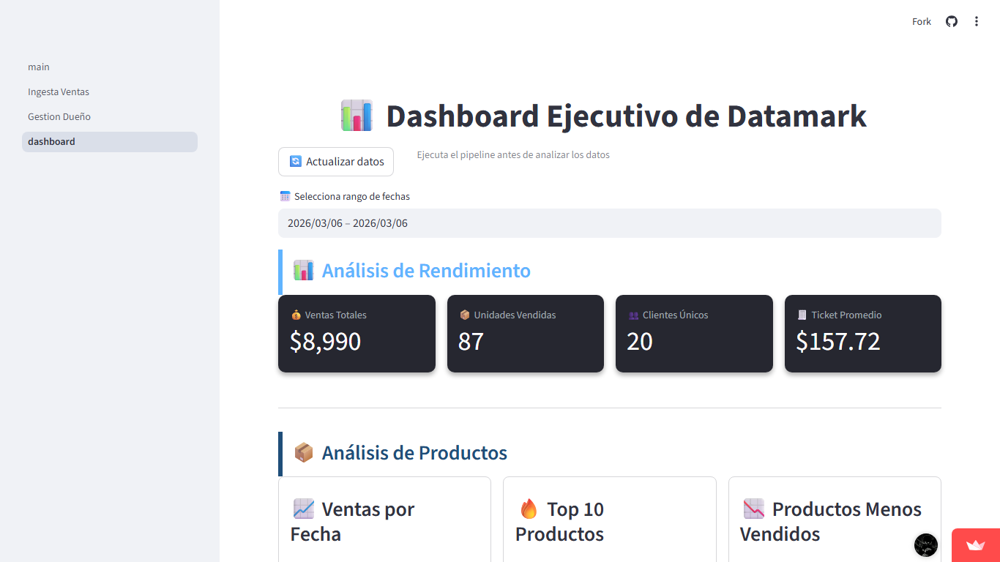
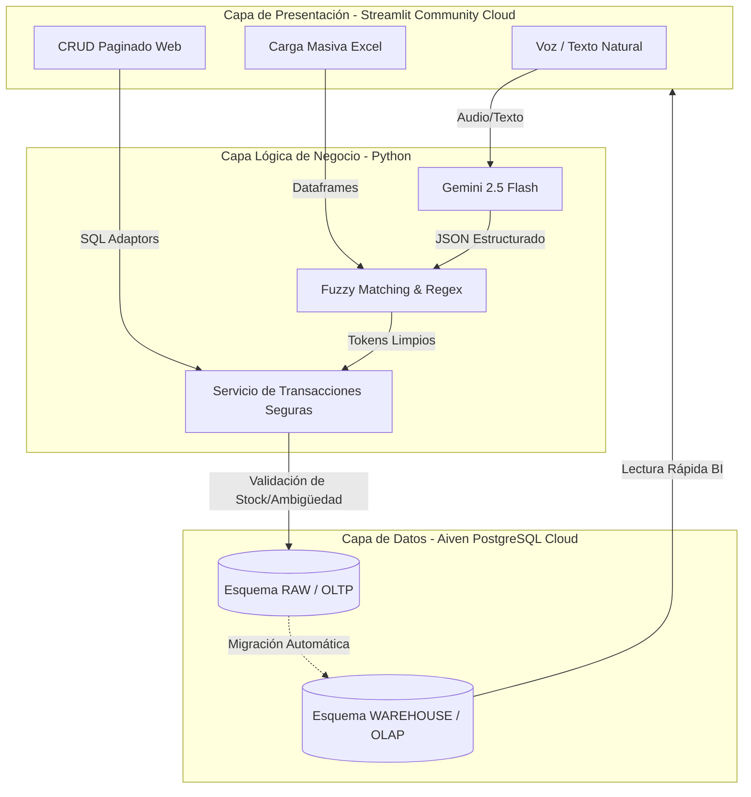

# DATAMARK - Plataforma Analítica y Transaccional Automatizada

## 🏆 Insignias


## 📌 Índice
- [Descripción](#-descripción)
- [Roles del Proyecto](#-roles-del-proyecto)
- [Funciones y Aplicaciones](#-funciones-y-aplicaciones)
- [Arquitectura Modular](#-arquitectura-modular)
- [Estructura del Proyecto](#-estructura-del-proyecto)
- [Tecnologías Utilizadas](#-tecnologías-utilizadas)
- [Base de Datos (Aiven PostgreSQL)](#-base-de-datos-aiven-postgresql)
- [Despliegue (Streamlit Cloud)](#-despliegue-streamlit-cloud)
- [Instalación y Contribución](#-instalación-y-contribución)

## 📙 Descripción
**DATAMARK** es una plataforma integral diseñada para pequeños y medianos negocios (retail, calzado, ropa) en provincias del Perú. Actúa como un *Data Analyst Automatizado*, combinando la facilidad de **Streamlit** para la ingesta de datos con NLP (Lenguaje Natural) y la solidez de **PostgreSQL** alojado en la nube de **Aiven**. Transforma la captura de ventas diarias y la gestión de inventario en reportes y dashboards dinámicos para la toma de decisiones.

> 🌐 **Prueba la Aplicación en Vivo**: [DATAMARK (Streamlit Community Cloud)](https://datamark-analytics.streamlit.app/Ingesta_Ventas)

## � Screenshots de la Plataforma
**(Reemplaza las rutas locales con las imágenes reales cuando las captures)*.*

| Landing Page | Ingesta de Datos (NLP & Excel) |
|:---:|:---:|
|  |  |
| **Control de Base de Datos (CRUD)** | **Dashboard Analítico** |
|  |  |

## �👥 Roles del Proyecto
El desarrollo se dividió en roles especializados para asegurar calidad y modularidad:
- **Implementador (Core & Backend)**: Creación de la arquitectura base, flujos transaccionales (CRUD), validaciones lógicas y conexiones seguras con la base de datos (`libs.db_connection`, Psycopg2 y SQL puro sin abstracciones innecesarias).
- **Especialista AI (NLP)**: Integración de los modelos Gemini Flash para permitir la inyección de datos a través de inteligencia artificial (dictados de voz y deducción de atributos faltantes).
- **Frontend / Data Viz**: Diseño de la SPA en el Framework de Streamlit, incluyendo el Landing Page y las gráficas analíticas interactivas.

## 🎥 Funciones y Aplicaciones
- **Ingesta Inteligente**: Registro de ventas mediante voz (dictado natural), carga masiva (Excel/CSV) o ingreso manual, con NLP y expresiones regulares deterministas.
- **Gestión CRUD Integrada**: Edición visual directa (`st.data_editor`) sobre las tablas transaccionales de la base de datos de manera paginada.
- **Dashboarding Dinámico**: Tableros analíticos creados en tiempo real leyendo directamente del Data Warehouse.
- **Validación Estricta**: Sistema anti-caídas que revisa relaciones físicas (Stock suficiente, Cliente existente) antes de impactar en la capa transaccional.

## 🏗️ Arquitectura de la Solución

El flujo de información desde la interacción del usuario hasta el almacenamiento analítico en la nube sigue un modelo robusto de tres capas:



## 📁 Estructura del Proyecto

El repositorio está diseñado bajo el principio de **Separación de Responsabilidades (SoC)**, asegurando que el código visual (Streamlit) no se mezcle con la lógica dura de base de datos o Inteligencia Artificial.

```text
proyecto-de-proyectos/
├── imagen/                           # Carpeta auto-gestionada para screenshots y recursos de UI
│   ├── Portada-Plataforma.png        # Banner principal del proyecto
│   └── placeholder_*.png             # Capturas generadas dinámicamente
│
├── libs/                             # 🧱 Core Técnico (Compartido)
│   ├── db_connection.py              # Singleton de conexión a Aiven PostgreSQL
│   ├── logger.py                     # Sistema de trazas (logInfo, logError) unificado
│   └── models.py                     # Centralización de consultas/modelos base
│
├── modules/                          # 🧠 Cerebro del Proyecto (Micro-Arquitecturas)
│   ├── dashboard/                    # Motor de Business Intelligence
│   │   ├── _init_.py                 
│   │   └── dashboard_logic.py        # Procesamiento Pandas para gráficos y KPIs en vivo
│   │
│   ├── gestion_dueño/                # Panel Administrativo
│   │   ├── components/               # UI de tablas y métricas owner-level
│   │   └── services/                 # Gestores de eliminación u operaciones destructivas
│   │
│   └── ingesta_ventas/               # 🎙️ Core Transaccional e IA
│       ├── app.py                    # Orquestador del módulo
│       ├── components/               # Interfaces Modulares
│       │   ├── voice_input.py        # Grabadora web y procesamiento NLP
│       │   ├── mass_upload.py        # Lector de Excel y formateador tabular
│       │   ├── manual_input.py       # Formularios Streamlit tradicionales
│       │   └── database_viewer.py    # El "CRUD Web" interactivo (st.data_editor)
│       └── services/                 # Conexiones con el Mundo Exterior
│           ├── db_service.py         # Consultas de ambigüedad, match exacto/fuzzy y triggers
│           ├── extraction_service.py # Comunicación con API Gemini 2.5 Flash
│           └── state_manager.py      # Gestor transversal de st.session_state
│
├── pages/                            # 🌐 Front-Door (Ruteo de Streamlit)
│   ├── 01_Ingesta_Ventas.py          # Enruta a modules/ingesta_ventas/app.py
│   ├── 02_Gestion_Dueño.py           # Enruta a modules/gestion_dueño
│   └── dashboard.py                  # Enruta a modules/dashboard
│
├── scripts/                          # 🛠️ Herramientas de Línea de Comandos (DevOps)
│   ├── capture_screenshots.py        # Bot de Playwright para tomar fotos automáticas a producción
│   ├── clear_aiven_db.py             # Peligro: Trunca la base de datos en Aiven
│   ├── temp_old_db.py                # Mocker: Rellena la BD con datos aleatorios para testing
│   └── export_data.py                # Volcados de seguridad
│
├── .env.example                      # Plantilla de secretos requeridos (Aiven / Gemini API)
├── requirements.txt                  # Strict list de dependencias Python (psycopg2, streamlit, etc)
├── main.py                           # Entrypoint de Streamlit corriendo el Landing Page
└── README.md                         # Este manifiesto global
```

## � Rutas y Módulos de la Interfaz (UI "Endpoints")
Dado que es una plataforma basada en Streamlit, los puntos de entrada funcionales se definen en la carpeta `pages/` y `modules/`:
- `🏠 Landing Page (main.py)`: Presentación ejecutiva del producto DATAMARK.
- `🎙️ Ingesta de Datos`: Interfaz principal para la captura de ventas a través de dictado por voz, carga masiva o manual.
- `📊 Dashboard Analítico`: Interfaz de BI para consumo de los esquemas Data Warehouse.
- `🧑‍�💻 Control Base de Datos`: Consola interactiva CRUD para operaciones directas en las tablas Raw.

## 💻 Tecnologías Utilizadas
- **Core de Programación**: Python 3.10+
- **Framework Frontend**: [Streamlit](https://streamlit.io/) (Despliegue Web Rápido y Análisis).
- **Procesamiento de Datos**: Pandas, NumPy, TheFuzz (Regex y coincidencia aproximada).
- **Inteligencia Artificial**: Google Gemini API (2.5 Flash).
- **Control de Bases de Datos**: `psycopg2` puro.

## 🗄️ Base de Datos (Aiven PostgreSQL)
**DATAMARK** se enorgullece de usar **[Aiven for PostgreSQL](https://aiven.io/)** como su base de datos principal, garantizando alta disponibilidad, seguridad y resiliencia en la nube. 
El diseño utiliza arquitectura por esquemas (`raw`, `staging`, `warehouse`), priorizando la estabilidad del OLTP.

### Tablas Principales (Esquema Raw)
| Tabla | Propósito | Características Clave |
|-------|-----------|-----------------------|
| `ventas_raw` | Almacena cada transacción individual de venta. | `id_venta` (PK), `id_producto` (FK), `id_cliente` (FK), cantidad, monto, metodo_pago, fecha. |
| `inventario_raw` | Catálogo de productos y control de stock físico disponible. | `id_producto` (PK), marca, modelo, color, talla, categoría, stock, precio_unitario. |
| `clientes_raw` | Directorio de clientes recurrentes e inyectados dinámicamente. | `id_cliente` (PK), nombre_cliente, ubicación, canal_captación. |

## 🔍 Ingesta con Inteligencia Artificial (NLP)
El corazón de la ingesta automatizada radica en su motor híbrido de procesamiento:
- **Google Gemini 2.5 Flash**: Encargado de parsear dictados de voz (ej: "Vendí dos zapatillas Nike rojas talla 40 por 150 soles a Juan en Lima") y estructurarlo en un JSON transaccional, infiriendo precios y cantidades.
- **TheFuzz (Fuzzy Matching)**: Algoritmo de distancia de Levenshtein (Token Sort Ratio) que cruza las extracciones del NLP con los nombres exactos de `inventario_raw` para evitar duplicidades por errores tipográficos.
- **Determinismo Fallback**: Expresiones regulares locales para extraer tallas estándar (S, M, L) o colores básicos y ahorrar costos de API.

## ☁️ Despliegue (Streamlit Cloud)
El proyecto ha sido concebido para ser hosteado bajo *Streamlit Community Cloud*. Toda la configuración ambiental dependiente (Aiven DB Hosts, Passwords, Gemini API Key) está estructurada para cargarse de forma segura a través de los *Streamlit Secrets* (`.streamlit/secrets.toml` o variables de entorno), independizando el código fuente de los datos sensibles y facilitando integraciones continuas (CI/CD).
## 🚀 Instalación y Contribución

### 1. Requisitos Previos
- Python 3.10 o superior ([Descargar aquí](https://www.python.org/downloads/)).
- Git ([Descargar aquí](https://git-scm.com/)).

### 2. Clonar y Preparar el Entorno
```bash
# 1. Clona el repositorio
git clone https://github.com/No-Country-simulation/-S02-26-Equipo-53-Data-Science.git
cd -S02-26-Equipo-53-Data-Science

# 2. Crea un entorno virtual
python -m venv env

# 3. Activa el entorno
# En Windows:
env\Scripts\activate
# En Linux/Mac:
source env/bin/activate

# 4. Instala las dependencias
pip install -r requirements.txt
```

### 3. Configuración del Módulo
Copia el archivo base de variables y llena tus credenciales (Aiven PostgreSQL / Gemini):
```bash
cp .env.example .env
```

### 4. Ejecución del Proyecto
Inicia el servidor local de Streamlit:
```bash
streamlit run main.py
```

### 5. Flujo de Trabajo (Git Flow)
1. Haz un fork y asegurate de trabajar en tu máquina local en la rama adecuada (ej: `develop2`).
2. Haz check-out para tu feature: `git checkout -b <nombre-del-aporte>`
3. Empuja a tu repositorio: `git push origin HEAD`
4. Crea un **Pull Request** detallando tus adiciones funcionales.

## 🧪 Pruebas y Comandos Operativos
Si eres desarrollador, puedes apoyarte de los scripts locales ubicados en la carpeta `scripts/`:

### 1. Limpiar Base de Datos (Truncate Base)
Resetea las identidades y vacía las tablas transaccionales en Aiven.
```bash
python scripts/clear_aiven_db.py
```

### 2. Inyectar Mock Data (BETA)
Herramienta de testing para cargar volumen en un ambiente limpio:
```bash
python scripts/temp_old_db.py
```

## 🚨 Troubleshooting
- **Error psycopg2 `can't adapt type 'numpy.int64'`**: Ocurre en la interacción entre Streamlit (`st.data_editor`/Pandas) y Aiven. Los datos numéricos deben convertirse usando `.item()` a tipos Python nativos antes de viajar por Psycopg2. (Resuelto en `database_viewer.py`).
- **Connection Refused (Aiven)**: Verifica que tu IP no cambie dinámicamente, o en su defecto que esté permitida en los firewalls de Aiven y que tus credenciales en el `.env` o en los *Streamlit Secrets* estén vigentes.
- **Botón de Micrófono no responde**: Verifica que los permisos del navegador permitan el uso de `audio` para aplicaciones locales corriendo bajo localhost.
