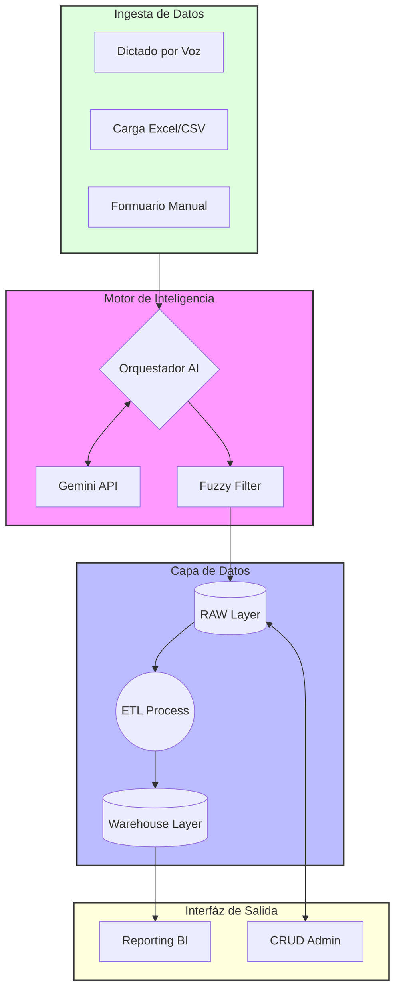

# 📔 Portal de Documentación Técnica - DATAMARK

---

## 🌟 Introducción
Bienvenido al cerebro de **DATAMARK**. Este repositorio de documentación ha sido diseñado para proporcionar una "estabilidad máxima" en la comprensión del proyecto. No se trata solo de manuales, sino de una hoja de ruta técnica completa que explica cómo transformamos la incertidumbre del lenguaje natural en datos accionables para negocios reales.

> [!TIP]
> Esta documentación utiliza diagramas dinámicos de **Mermaid**. Si no se visualizan correctamente, asegúrate de usar un visor compatible con GFM (GitHub Flavored Markdown).

---

## 🎯 Objetivos de la Plataforma
La misión de DATAMARK se resume en cuatro pilares fundamentales:

1.  **Fricción Cero**: Permitir que cualquier dueño de negocio ingrese datos sin necesidad de teclados, solo con su voz.
2.  **Integridad Absoluta**: Garantizar que cada transacción impacte de forma correcta y segura en el inventario real.
3.  **Inteligencia Adaptativa**: Utilizar LLMs para entender el contexto y corregir errores humanos de forma proactiva.
4.  **Escalabilidad en la Nube**: Mantener una infraestructura robusta capaz de crecer junto al negocio.

---

## 🏗️ Mapa de Arquitectura General
A continuación, se presenta la visión holística de la orquestación del sistema:

---

## 📂 Recursos de Profundización
Haz click en los enlaces para explorar los detalles técnicos de cada componente:

- 🏗️ **[Arquitectura](arquitectura.md)**: Detalle de capas, diagramas de secuencia e infraestructura.
- 🗄️ **[Ingeniería de Datos](base_de_datos.md)**: Modelado Star Schema, disparadores PL/pgSQL y esquemas.
- 🤖 **[Inteligencia Artificial](ia_nlp.md)**: Prompt engineering, fallback de modelos y lógica NLP.
- 🚀 **[Funcionalidades](funcionalidades.md)**: Desglose de submódulos de ingesta, auditoría y BI.
- 🛠️ **[Guía de Desarrollo](guia_desarrollo.md)**: Setup de entorno, DevOps y Troubleshooting.

---

## 🛠️ Setup Operativo (Quick Start)
Para poner en marcha la infraestructura de documentación y desarrollo:

1.  **Variables de Entorno**: Asegúrate de tener configurado tu `.env` con las credenciales de Aiven y Gemini.
2.  **Base de Datos**: Ejecuta el script `db_model.sql` para inicializar los esquemas `raw`, `staging` y `warehouse`.
3.  **Servidor**: Inicia el orquestador con `streamlit run main.py`.

> [!IMPORTANT]
> Para contribuciones relacionadas con la documentación, por favor mantén el estándar de Mermaid y utiliza las etiquetas de alerta (`NOTE`, `TIP`, `IMPORTANT`, `WARNING`, `CAUTION`) para resaltar información crítica.

---

## 🎨 Características de Diseño
- **Modularidad**: Cada archivo `.md` es independiente pero está interconectado.
- **Visualización**: Priorizamos diagramas sobre bloques de texto extensos.
- **Consistencia**: Uso de nomenclatura técnica en inglés para código y español para explicaciones.

---

