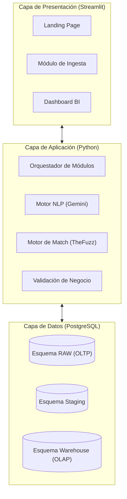
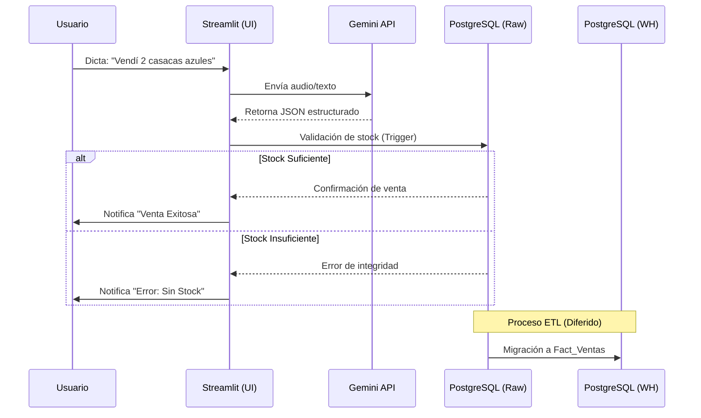

# 🏗️ Arquitectura de la Solución

DATAMARK implementa una arquitectura desacoplada basada en el principio de separación de responsabilidades (SoC), utilizando Python como orquestador central.

## 📐 Vista de Alto Nivel

## 🔄 Ciclo de Vida de una Venta

El proceso desde que el usuario dicta una venta hasta que aparece en el dashboard analítico:

## 🛠️ Stack Tecnológico Interno

- **Frontend**: Streamlit 1.40+ con componentes personalizados para grabación de audio.
- **Backend**: Python 3.10+ utilizando `psycopg2` para interactuar con la base de datos de manera determinista.
- **IA**: Modelos Gemini (Flash 1.5, 2.5, 3.1) con sistema de fallback automático.
- **Data**: Aiven PostgreSQL 16 con aislamiento de esquemas.
