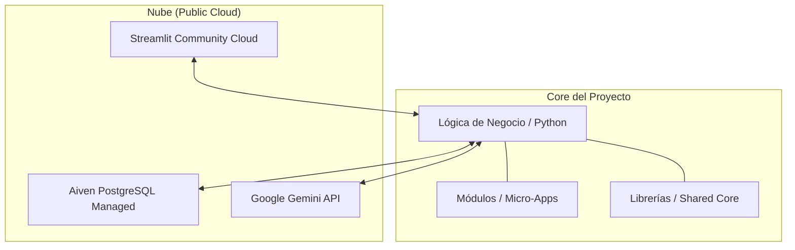
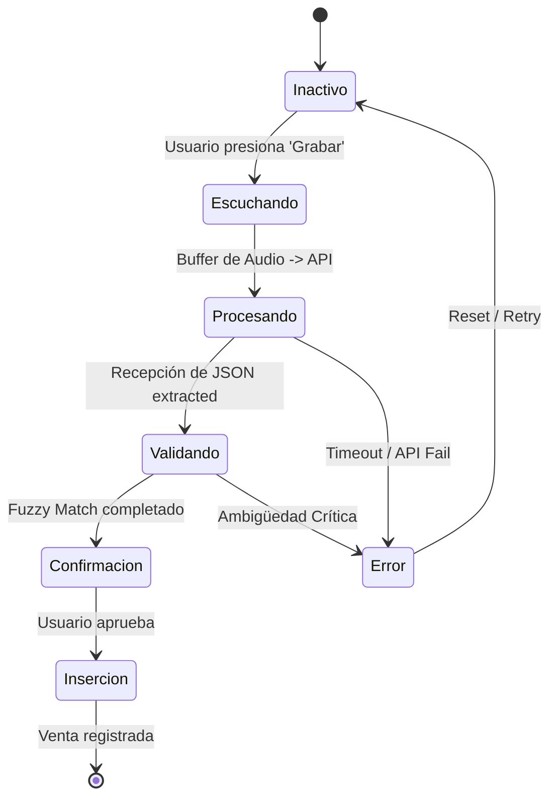

# 🏗️ Arquitectura de la Solución

## 🗺️ Introducción Arquitectónica
La arquitectura de DATAMARK se basa en la **Separación de Responsabilidades (SoC)**. Hemos diseñado un sistema donde el flujo de información es unidireccional y predecible, minimizando los efectos secundarios en la base de datos transaccional.

---

## 📐 Topología de Capas

---

## 🔄 Estados del Sistema
El orquestador de Streamlit gestiona el ciclo de vida de la aplicación mediante un motor de estados finito (Finite State Machine) simplificado en el `state_manager.py`.

---

## 🔧 Componentes de Software

### 1. Orquestador de Módulos
Localizado en `modules/[nombre_modulo]/app.py`. Es el encargado de inicializar los componentes de UI y llamar a los servicios de backend correspondientes.

### 2. Capa de Servicios
Contiene la lógica pesada de interacción externa:
- **`db_service.py`**: Adaptadores SQL y validaciones deterministas.
- **`extraction_service.py`**: Interfaz con el LLM y lógica de reintentos.

### 3. Shared Libs (`libs/`)
- **`db_connection.py`**: Implementa el patrón Singleton para asegurar una única gestión del pool de conexiones a Aiven.
- **`logger.py`**: Sistema de trazas jerárquico para auditoría en tiempo real.

---

## 🧪 Estrategia de Estabilidad
Para garantizar la máxima disponibilidad, implementamos:
- **Fallback de Modelos**: Descenso gradual de Gemini 3.1 -> 1.5 si se detectan cuotas excedidas.
- **Circuit Breaker**: Si la base de datos no responde, la aplicación entra en modo 'Solo Lectura' sobre el caché local de sesión.

---
> [!TIP]
> Puedes encontrar más detalles sobre el comportamiento de la IA en la sección [Inteligencia Artificial](ia_nlp.md).
