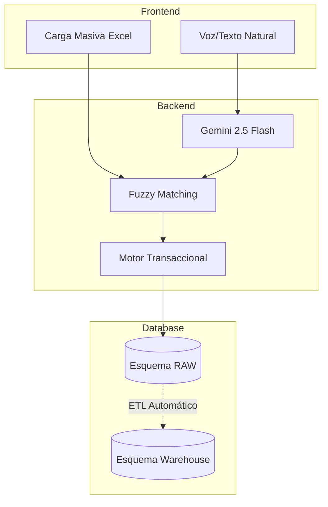

# 🏗️ Arquitectura de la Solución

DATAMARK utiliza un modelo robusto de tres capas para asegurar escalabilidad y modularidad.

## 🧱 Capas de la Aplicación

### 1. Capa de Presentación (Frontend)
- **Tecnología**: [Streamlit](https://streamlit.io/)
- **Despliegue**: Streamlit Community Cloud
- **Componentes**: 
  - Landing page interactiva.
  - Formularios de ingesta (Voz/Excel).
  - Dashboard analítico.

### 2. Capa Lógica de Negocio (Backend)
- **Tecnología**: Python 3.10+
- **IA**: Google Gemini 2.5 Flash para procesamiento de lenguaje natural.
- **Lógica**: Fuzzy matching para validación de datos y servicios de conexión a BD.

### 3. Capa de Datos
- **Tecnología**: [Aiven PostgreSQL](https://aiven.io/)
- **Arquitectura**: Separación por esquemas (`raw`, `warehouse`).

## 🔄 Flujo de Datos (Pipeline)

