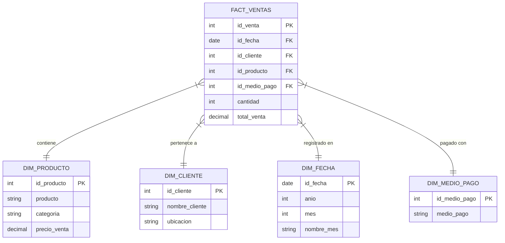

# 🗄️ Ingeniería de Datos y Modelado


## 🧬 Filosofía del Dato
En DATAMARK, el dato nace en un entorno ruidoso (voz del usuario) y viaja a través de capas de refinamiento hasta convertirse en un activo estático y veraz en el Warehouse.

---

## 🧱 Diccionario de Datos Master

### Capa RAW (Transaccional)
| Tabla | PK | FK Relevantes | Propósito |
| :--- | :--- | :--- | :--- |
| `ventas_raw` | `id_venta` | `id_producto`, `id_cliente` | Captura inmediata de transacciones. |
| `inventario_raw` | `id_producto` | - | Estado actual y catálogo de productos. |
| `clientes_raw` | `id_cliente` | - | Directorio de clientes inyectados. |

---

## 📐 Diagrama de Entidad-Relación (Warehouse)
Optimizado para análisis bajo el modelo Star Schema.



---

## ⚡ El Corazón de la Integridad: PL/pgSQL
Para asegurar que el stock nunca sea inconsistente en un entorno de alta concurrencia, utilizamos funciones integradas en el motor de base de datos:

```sql
-- Lógica simplificada del Trigger de Stock
CREATE FUNCTION descontar_stock() RETURNS TRIGGER AS $$
BEGIN
    -- Bloqueo pesimista para evitar sobrefacturación
    PERFORM FROM raw.inventario_raw 
    WHERE id_producto = NEW.id_producto FOR UPDATE;
    
    UPDATE raw.inventario_raw 
    SET stock_actual = stock_actual - NEW.cantidad
    WHERE id_producto = NEW.id_producto;
    
    RETURN NEW;
END;
$$ LANGUAGE plpgsql;
```

---

## 📊 Estrategia de Data Warehouse
1.  **Staging Area**: Espacio temporal donde se limpian los nulls y se normalizan las categorías antes de la carga final.
2.  **SCD (Slowly Changing Dimensions)**: Implementamos Tipo 1 para productos; las actualizaciones de nombre o precio sobreescriben la versión anterior para mantener la simplicidad del MVP.

---
> [!IMPORTANT]
> Nunca realices inserciones directas en el esquema `warehouse`. El flujo debe ser siempre `RAW -> STAGING -> WAREHOUSE`.
