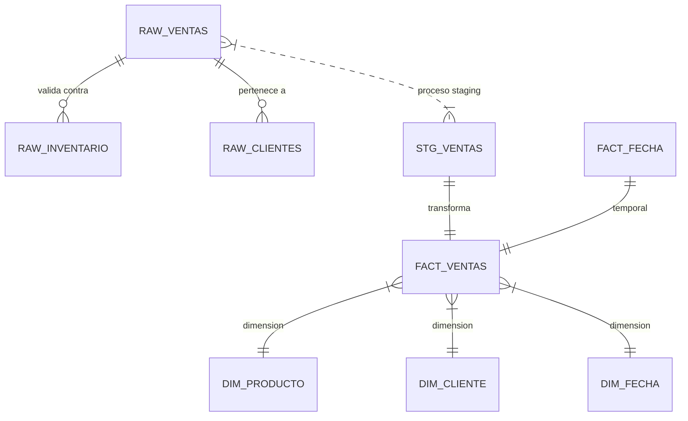

# 🗄️ Ingeniería de Datos

DATAMARK gestiona el ciclo de vida completo del dato, desde su captura ruidosa hasta su visualización limpia.

## 🏛️ Estructura de Esquemas

### 1. Capa Transaccional (RAW)
Ubicada en el esquema `raw`, esta capa prioriza la velocidad de inserción y la integridad inmediata.
- **Trigger `trigger_descontar_stock_raw`**: Función en PL/pgSQL que bloquea la fila del producto (`FOR UPDATE`) para evitar condiciones de carrera y garantiza que el stock nunca sea negativo.

### 2. Capa Analítica (Warehouse)
Diseño de **Modelo Estrella** en el esquema `warehouse`, optimizado para agregaciones rápidas.

| Tabla | Tipo | Descripción |
| :--- | :--- | :--- |
| `fact_ventas` | Fact | Métricas de ventas (cantidad, precio, total). |
| `fact_inventario` | Fact | Estado actual del stock analítico. |
| `dim_producto` | Dim | SCD Tipo 1 para atributos de producto. |
| `dim_cliente` | Dim | Perfiles de clientes y canales. |
| `dim_fecha` | Dim | Atributos temporales (mes, año, día de semana). |

## ⚙️ Optimización
- **Índices**: B-Tree sobre `id_fecha` e `id_cliente` en `fact_ventas` para acelerar filtros en el dashboard.
- **Tipado Estricto**: Uso de `NUMERIC(10,2)` para evitar errores de precisión de punto flotante en cálculos financieros.
