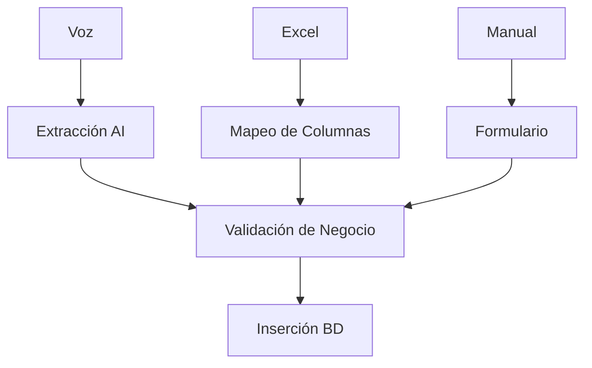

# 🚀 Funcionalidades y Módulos

DATAMARK está compuesto por módulos especializados que cubren todo el espectro de la gestión de un negocio.

## 🎙️ Módulo de Ingesta Inteligente
Este módulo es la puerta de entrada principal de datos.

- **Voz a Datos**: Interfaz minimalista con un solo botón de grabación.
- **Carga Masiva**: Soporta `.xlsx` y `.csv`. La IA sugiere automáticamente el mapeo de columnas si los nombres no coinciden exactamente.
- **Corrector de Ambigüedad**: Si la IA encuentra que un producto puede ser varios, se le pide al usuario que elija de una lista sugerida mediante Fuzzy Match.

## 📊 Módulo de Gestión y Auditoría
Panel administrativo para el dueño del negocio.
- **CRUD Paginado**: Edición de miles de registros sin degradar el rendimiento del navegador.
- **Auditoría IA**: Escaneo periódico de la base de datos para detectar inconsistencias (ej: precios sospechosamente bajos para una categoría).

## 📈 Módulo de Dashboards BI
Visualizaciones potentes para la toma de decisiones.
- **Ventas Reales vs Proyectadas**.
- **Top 5 Productos más rentables**.
- **Mapa de calor de ventas por ubicación**.
