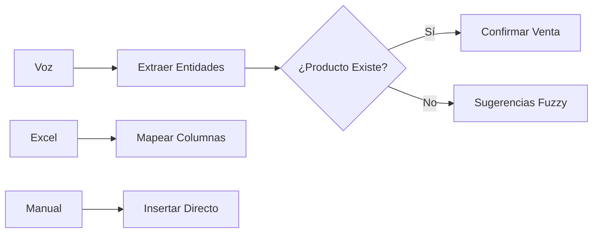
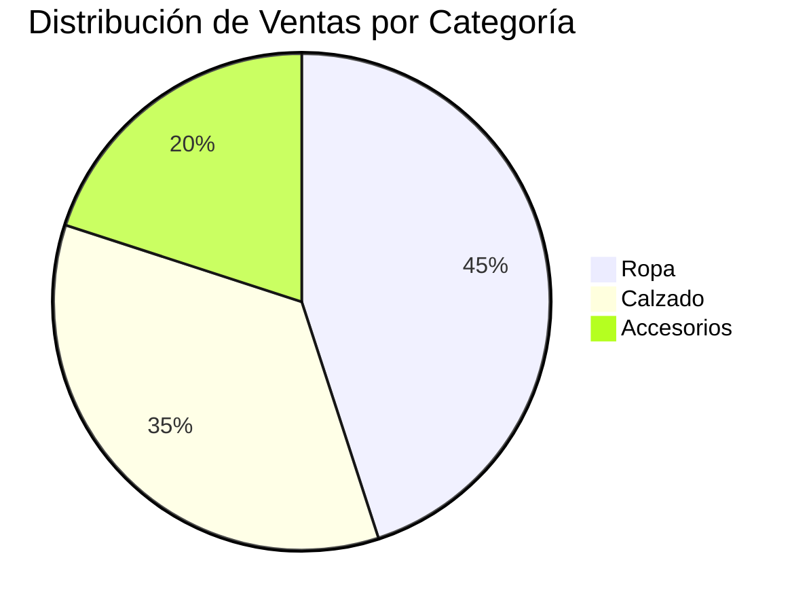

# 🚀 Funcionalidades y Capacidades

## 🎨 Visión General
DATAMARK no es solo un registrador de datos; es un asistente de negocio proactivo. Cada módulo ha sido diseñado pensando en la eficiencia operativa y la claridad visual.

---

## 🎙️ Ingesta Inteligente (Smart Ingestion)
Es el componente estrella que elimina la barrera de entrada tecnológica para el usuario.

### Características Clave:
- **Detección Dinámica**: Identifica automáticamente si lo que el usuario dice es una venta o un movimiento de inventario.
- **Mapeo Automático**: Durante la carga masiva, la IA predice qué columna del Excel del usuario se refiere al "Precio" o "Producto", incluso con nombres de columna diferentes.

---

## 🛠️ Gestión Transaccional y Auditoría
Un panel de control robusto para la supervisión diaria.

| Función | Herramienta | Beneficio |
| :--- | :--- | :--- |
| **CRUD Directo** | `st.data_editor` | Edición masiva con un solo clic. |
| **Paginación Dinámica** | SQL `LIMIT/OFFSET` | Navegación fluida en miles de registros. |
| **Auditoría IA** | Gemini Scan | Detección automática de anomalías de precios. |

---

## 📈 Power Dashboards (BI)
Visualización de alto impacto para la toma de decisiones basada en datos, no en intuiciones.

### KPIs Soportados:
- **Revenue Diario/Semanal/Mensual**.
- **Churn Rate de Clientes**.
- **Stock de Seguridad**: Alertas automáticas cuando un producto baja de cierto umbral.
- **Captación**: Análisis de qué canales (Voz vs Manual) son más efectivos.

---
> [!TIP]
> Puedes extender las capacidades del dashboard agregando consultas SQL personalizadas en `modules/dashboard/dashboard_logic.py`.
