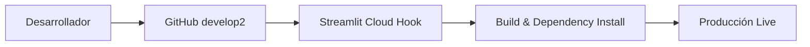

# 🛠️ Guía de Ingeniería y DevOps

Instrucciones avanzadas para el mantenimiento y despliegue del ecosistema DATAMARK.

## 📦 Stack de Desarrollo
- **Lenguaje**: Python 3.10.12
- **Framework Web**: Streamlit 1.40.1
- **Driver DB**: `psycopg2-binary`
- **NLP**: `google-generativeai` 0.8.3

## 🏗️ Flujo de CI/CD (Streamlit Cloud)



### Configuración de Secretos
Para que la aplicación funcione en la nube, es CRÍTICO configurar los secretos en Streamlit Cloud:

```toml
GEMINI_API_KEY = "tu_llave"
DB_HOST = "tu_host_aiven"
DB_NAME = "defaultdb"
DB_USER = "avnadmin"
DB_PASS = "tu_password"
DB_PORT = "12345"
```

## 🚨 Troubleshooting Común

| Error | Causa Probable | Solución |
| :--- | :--- | :--- |
| `ConnectionRefusedError` | IP no autorizada en Aiven. | Agregar `0.0.0.0/0` en el firewall de Aiven (solo para desarrollo). |
| `NLP Extraction Error` | API Key expirada o cuota excedida. | Verificar cuota en Google AI Studio. El sistema intentará fallback automáticamente. |
| `St.data_editor type error` | Tipos NumPy en base de datos. | Usar `.item()` para convertir a Python nativo antes de `INSERT`. |

## 🧪 Comandos de Limpieza
```bash
# Limpiar caché de Streamlit
streamlit cache clear
# Resetear base de datos (USAR CON PRECAUCIÓN)
python scripts/clear_aiven_db.py
```
