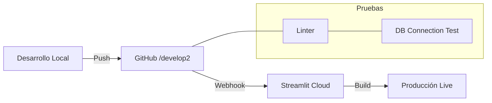

# 🛠️ Guía de Ingeniería y Operaciones

<p align="center">
  
  
  
</p>

## 🏗️ Flujo de Entrega Continua
La estabilidad del proyecto se basa en un flujo de despliegue automatizado y predecible.



---

## 🔑 Gestión de Secretos y Variables
Nunca subas valores sensibles al repositorio. DATAMARK utiliza un sistema jerárquico de carga de secretos:

1.  **Local**: Archivo `.env` (Ignorado por Git).
2.  **Producción**: `Streamlit Secrets` (Panel de control de la nube).

### Ejemplo de Configuración Estándar:
```toml
# .streamlit/secrets.toml
[connections.postgresql]
dialect = "postgresql"
host = "tu-host.aivencloud.com"
port = 12345
database = "defaultdb"
username = "avnadmin"
password = "tu-password"
sslmode = "require"

[api_keys]
gemini = "AIza..."
```

---

## 🩺 Diagnóstico y Troubleshooting (Estabilidad Máxima)

> [!WARNING]
> Si la aplicación muestra un error de conexión, verifica primero el estado del servicio en el panel de **Aiven console**.

| Síntoma | Posible Causa | Solución Sugerida |
| :--- | :--- | :--- |
| `Internal Server Error` | Variables de entorno faltantes. | Verifica el panel de Secrets en Streamlit Cloud. |
| `St.data_editor` bloqueado | Error de tipos en el DataFrame. | Revisa que no haya valores `NaN` en columnas integras. |
| Audio no captura | Permisos de navegador denegados. | Habilita el micrófono para el dominio `*.streamlit.app`. |

---

## 🧪 Comandos de Administración Avanzada
Utiliza estos scripts para tareas de mantenimiento pesado:

```bash
# Limpiar datos transaccionales (Cuidado: Irreversible)
python scripts/clear_aiven_db.py

# Generar datos de prueba masivos (Mocker)
python scripts/temp_old_db.py

# Capturar estado visual para auditoría
python scripts/capture_screenshots.py
```

---
> [!IMPORTANT]
> Mantén siempre actualizado el archivo `requirements.txt` para evitar derivas de dependencias en el entorno de despliegue.
