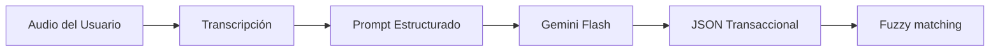

# 🤖 Inteligencia Artificial y NLP

La inteligencia de DATAMARK reside en su capacidad para transformar el lenguaje humano en estructuras de datos rígidas y precisas.

## 🧠 Motor de Extracción (Gemini)

Utilizamos una estrategia de **Multi-Modelo Fallback** para garantizar alta disponibilidad:
1. `gemini-3.1-flash-preview` (Prioridad Alta)
2. `gemini-3-flash-preview`
3. `gemini-2.5-flash`
4. `gemini-1.5-flash` (Estabilidad Máxima)

### Ingeniería de Prompts
El sistema utiliza prompts especializados según el contexto:
- **Ingesta de Ventas**: Enfocado en extraer entidades como `producto_base`, `talla`, `cantidad` y `medio_payo` basándose en la fecha actual.
- **Carga de Inventario**: Clasificación estricta en categorías ("Ropa", "Calzado" o "Accesorio") y detección de precios de adquisición.

## 🔍 Motor de Coincidencia (Fuzzy Matching)

Dado que un usuario puede decir "Polo Nike" y en la base de datos figurar "Nike Polo Sport", implementamos `TheFuzz`:
- **Algoritmo**: `Token Sort Ratio`.
- **Umbral de Confianza**: Generalmente > 80% para sugerencias automáticas.
- **Validación Determinista**: Limpieza de "stop-words" y normalización de tallas (S -> Small, etc) antes de pasar al motor de match.

## 🎙️ Procesamiento de Audio
Integración con `streamlit_mic_recorder` para capturar audio en formato WAV, que luego es procesado por el buffer de memoria y enviado a la API para su interpretación directa.
