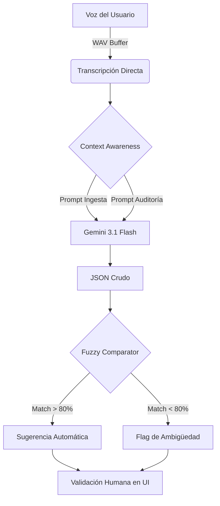

# 🤖 Inteligencia Artificial y NLP

<p align="center">
  
  
  
</p>

## 🧠 Introducción a la IA de DATAMARK
No utilizamos la IA solo como una herramienta de chat; es el **motor de parsing principal** de la aplicación. Su función es actuar como un traductor entre el lenguaje humano informal y el esquema relacional rígido de SQL.

---

## ⚙️ Arquitectura del Pipeline NLP



---

## 💬 Ingeniería de Prompts (Prompt Engineering)

Nuestro prompt maestro inyecta el estado actual del mundo para que la IA no alucine:

> *"Actúa como un asistente de ventas. Datos actuales: Hoy es {fecha}. Si el usuario dice 'lo de siempre', revisa el historial (próxima feature). Estructura el resultado en JSON..."*

### Reglas de Extracción Estrictas:
1.  **Detección de Entidades**: Identificación de marcas, colores y tallas de forma independiente.
2.  **Inferencia de Precios**: Si no se menciona el precio, la IA devuelve `null` para que el sistema consulte el `precio_venta_unitario` de `inventario_raw`.
3.  **Manejo de Cantidades**: Conversión de palabras ("un par", "media docena") a números enteros (2, 6).

---

## 🔍 Motor de Coincidencia (Fuzzy Logic)
Utilizamos la distancia de Levenshtein para resolver discrepancias entre lo que el usuario dice y lo que la base de datos tiene.

| Usuario Dice | Inventario Real | Score Match | Acción |
| :--- | :--- | :--- | :--- |
| "Zapas Nike" | "Zapatillas Nike Urb" | 88% | Auto-link |
| "Polo Rojo" | "Polo Sport Rojo L" | 92% | Auto-link |
| "Casaca" | ["Casaca Cuero", "Casaca Jean"] | 50% | Mostrar Lista |

---

## 🚀 Estrategia de Fallback (Resiliencia)
Para asegurar la "estabilidad máxima", el servicio `extraction_service.py` implementa un bucle de reintentos con degradación de modelos:

```python
MODELS_BACKUP = [
    "gemini-3.1-flash-preview", # Mejor razonamiento
    "gemini-3-flash-preview",
    "gemini-2.5-flash"          # Más balanceado
]
```

> [!CAUTION]
> El uso excesivo de modelos de pre-visualización puede generar latencias variables. Se recomienda el uso de `gemini-1.5-flash` para entornos de producción masiva.

---
> [!TIP]
> Puedes probar la efectividad del motor NLP en el componente de **Ingesta de Ventas** de la aplicación.
