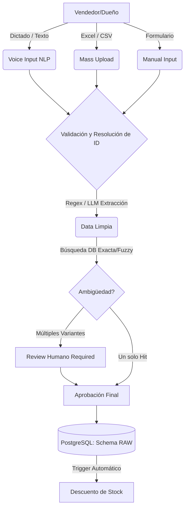

# Documentación: Módulo de Ingesta de Datos (Ventas e Inventario)

## 1. Descripción del Proyecto General
El proyecto es una plataforma integral de gestión comercial diseñada para modernizar y optimizar tiendas minoristas. Permite registrar transacciones comerciales, controlar el inventario en tiempo real y consolidar los datos de clientes. El sistema está construido con un enfoque híbrido que combina facilidad de uso para usuarios no técnicos (vendedores y dueños) con un backend robusto basado en un modelo de Data Warehouse en PostgreSQL.

## 2. Descripción Específica de esta Parte (Módulo de Ingesta)
Este módulo representa el "punto de entrada" de toda la información comercial de la plataforma. Su objetivo es capturar las interacciones diarias (Ventas) y el estado físico de los productos (Inventario) a través de tres modalidades flexibles:
1. **Entrada por Voz/Texto Natural**: Utiliza NLP (Gemini) para que el vendedor registre ventas dictando ("Venta de 1 polo negro talla S").
2. **Entrada Manual Tradicional**: Formulario estructurado para registros medidos.
3. **Carga Inteligente por Lotes**: Subida masiva mediante archivos Excel/CSV para migraciones iniciales o actualizaciones grupales.

## 3. Problema que Resuelve
* **Cuellos de botella operativos**: El registro manual tradicional de ventas es lento y propenso a errores humanos durante el ajetreo de una tienda.
* **Datos Desestructurados**: Los dueños suelen tener reportes de inventario o ventas en Excel mal estructurados o con omisiones.
* **Integridad de Datos**: Registrar una venta de un producto que no existe en el catálogo o que no tiene stock desbalancea la contabilidad.
* **Falta de Adopción Técnica**: Sistemas de punto de venta (POS) rígidos que exigen IDs de productos, asustando a usuarios no técnicos.

## 4. Arquitectura del Proyecto
La plataforma utiliza una arquitectura por capas:
* **Frontend**: Streamlit (Python) para interfaces interactivas y rápidas.
* **Servicios Lógicos**: Módulos en Python para limpieza de datos (Pandas), llamadas a APIs externas (Google Gemini) y validación estructurada mediante Regex.
* **Capa de Datos**: PostgreSQL actuando como capa transaccional (`raw`) y Data Warehouse (`warehouse`).

## 5. Arquitectura Específica de esta Parte
El módulo de ingesta se divide en:
* `app.py`: Controlador principal de flujo y estado.
* `components/`:
  * `mass_upload.py`: Gestión de carga de Excel, extracción determinista por Regex y cruce relacional inteligente.
  * `voice_input.py`: Interfaz de micrófono, integración NLP y cuadridrícula de corrección.
  * `manual_input.py`: Formularios tradicionales.
* `services/`:
  * `db_service.py`: Consultas estructuradas (búsqueda de IDs predecibles vía prioridades), manejo transaccional (rollback si falla el stock) y verificación de ambigüedad.
  * `extraction_service.py`: Lógica de inferencia o sugerencias vía LLM y Regex.

## 6. Diagrama de Arquitectura

## 7. Modelo Dimensional
El diseño de la base de datos implementa una estrategia de modelado dimensional tipo Estrella/Copo de Nieve para habilitar el Business Intelligence.
* **Hechos (Facts)**: `fact_ventas`, `fact_inventario`.
* **Dimensiones (Dimensions)**: `dim_producto`, `dim_cliente`, `dim_fecha`, `dim_medio_pago`.

## 8. Data Warehouse
Utilizamos esquemas separados lógicamente en la misma base PostgreSQL:
* `raw`: Tablas transaccionales donde cae la ingesta en vivo (`ventas_raw`, `inventario_raw`, `clientes_raw`). Tienen triggers para validar y descontar stock.
* `staging`: Tablas temporales/intermedias para las transformaciones del bloque ETL.
* `warehouse`: Tablas optimizadas para consulta analítica final multidimensional.

## 9. Diagrama de Modelo (Capa Warehouse)

```mermaid
erDiagram
    FACT_VENTAS {
        int id_venta PK
        date id_fecha FK
        int id_cliente FK
        int id_producto FK
        int id_medio_pago FK
        int cantidad
        numeric precio_venta_unitario
        numeric total_venta
    }
    DIM_PRODUCTO {
        int id_producto PK
        varchar producto
        varchar talla
        varchar color
        varchar categoria
    }
    DIM_CLIENTE {
        int id_cliente PK
        varchar nombre_cliente
        varchar genero
    }
    DIM_FECHA {
        date id_fecha PK
        int anio
        int mes
        varchar dia_semana
    }
    
    FACT_VENTAS }|--|| DIM_PRODUCTO : contiene
    FACT_VENTAS }|--|| DIM_CLIENTE : hecho_por
    FACT_VENTAS }|--|| DIM_FECHA : ocurre_en
```

## 10. Tecnologías Utilizadas
* **Lenguaje**: Python 3
* **Framework Web**: Streamlit
* **Procesamiento de Datos**: Pandas, Regex (re)
* **Base de Datos**: PostgreSQL, `psycopg2`
* **Inteligencia Artificial**: Google Gemini 2.5 Flash API (solo para lenguaje natural extenso, no atributos locales)
* **Control de Versiones y Modelado**: Git, Mermaid

## 11. Flujo ETL Implementado (Fase Extract & Load Inicial)
1. **Extract**: Obtención de datos mediante texto no estructurado o dataframes Pandas sucios.
2. **Transform (Pre-Load)**:
   * **Limpieza Híbrida**: Extracción de tallas (`S, M, L, XL`) y colores comunes vía Regex de manera determinística a costo $0.
   * **Resolución Relacional Intuitiva**: Búsqueda en 3 fases: Match exacto (Nombre+Talla+Color) -> Match Nombre+Talla -> Fallback de solo nombre.
   * **Manejo de Ambigüedad**: Detección de múltiples variantes devolviendo el poder a la capa visual humana.
3. **Load**: Inserción parametrizada hacia PostgreSQL (`raw`) con manejo transaccional robusto (Atomicidad: todo o nada) y confirmación por `rowcount` para validar stock.

## 12. Estado Actual del Proyecto (Capa de Ingesta)
* ✅ **Extracción por NLP** operativa.
* ✅ **Bulk Upload** con mapeo inteligente de columnas finalizado.
* ✅ **Limpieza Determinista y $0 API Cost** mediante Regex para captura de variantes incorporada y refactorizada en la carga masiva.
* ✅ **Gestión Humana en Bucle**: El Panel de Dueño muestra explícitamente qué IDs ha auto-gestionado el sistema y señala con banderas de conflicto `❓ Ambiguo` aquellos productos con variantes (Ej. "Hubo 3 polos, seleccioné el primero").
* ✅ **Integridad Referencial Estricta**: No se pueden grabar ventas al vuelo sin referir a un ID físico preexistente con stock validado a nivel de base de datos.
* ⏳ **Ingreso Manual Tradicional**: Pestaña visual activa, integración relacional en proceso de acabado.

## 13. Próximos Pasos
* Integrar la capa manual remanente y estabilizar triggers de la BD mediante pipelines automatizados de staging a warehouse.
* Desarrollar el **Módulo de Análisis y Dashboards** leyendo de los esquemas `warehouse`.
* Añadir un proceso CRON que orqueste la migración asíncrona de `raw` -> `staging` -> `warehouse`.

## 14. Impacto Esperado
* Reducción drástica del tiempo de registro en Punto de Venta (POS) a menos de 10 segundos por orden usando dictado.
* Erradicación de las dobles contabilidades gracias al control estricto de resolución determinista.
* Abaratamiento de costos operativos gracias al uso inteligente y condicionado de IA (priorizando Regex locales).
* Transición de negocios de papel/excel hacia una Arquitectura Analítica Corporativa y escalable con fricción nula para el tendero.
